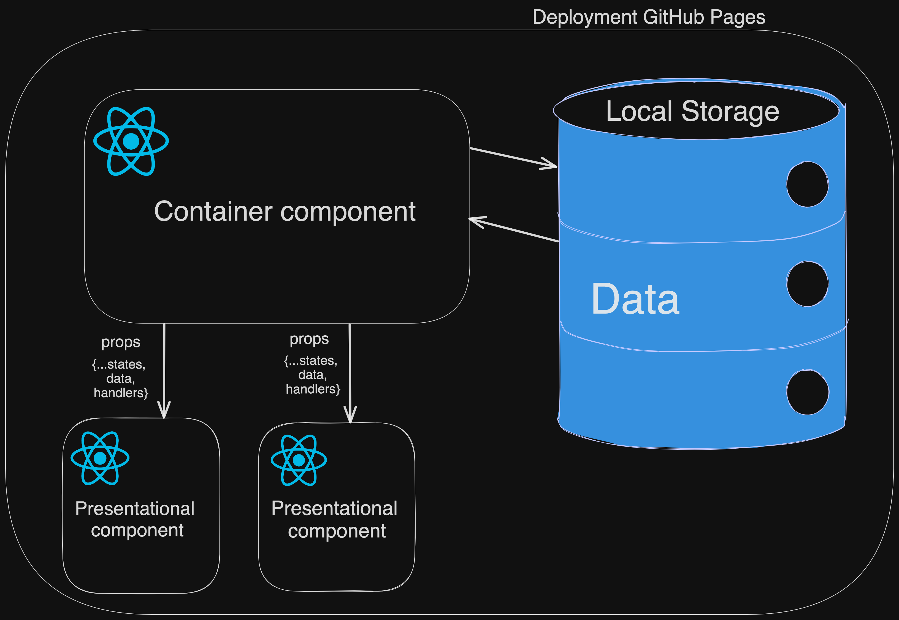
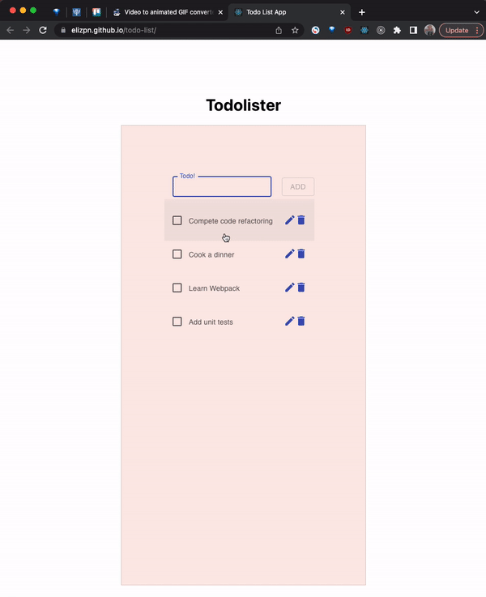
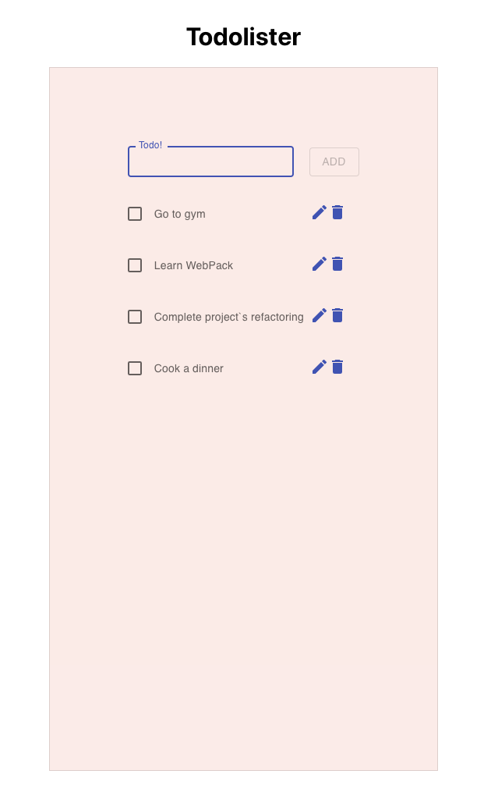

# `TaskMaster`

With TodoLister you can write down the most important tasks for the day, week or month. You can always edit or delete your task. 
Don't worry to close dotolister, when you next time open the App, all tasks will be restored. 

Deployed to GitHub Pages: https://elizpn.github.io/todo-list/

-  Language - [TypeScript](https://www.typescriptlang.org/)
-  Data storage - [Local storage](https://developer.mozilla.org/en-US/docs/Web/API/Window/localStorage)
-  Client Framework - [React](https://reactjs.org)
-  Testing - [Jest](https://jestjs.io), [React Testing Library](https://testing-library.com)
-  Styles - [Material UI](https://mui.com/) 

## Architecture: 

 

## Implementation specifics:
Data is stored in local storage.

## Demo:
 

## Screenshots:

### Desktop (macOS, Chrome):
 
 

